# MDReader 全能力示例

> 这份文档覆盖了 MDReader 的全部渲染能力：KaTeX 数学公式、Mermaid 图表（所有离线可用的类型）、ECharts 统计图表、WaveDrom 时序波形、函数图像，以及代码高亮、表格、任务列表等排版能力。
>
> 用法：拖入阅读器，或用「打开方式」双击本文件；左右侧目录可导航，右上角可切换深浅主题、输出 PDF。

---

## 一、公式能力（KaTeX）

### 1.1 行内公式

质能方程 $E = mc^2$ 是物理学最著名的公式；欧拉恒等式 $e^{i\pi} + 1 = 0$ 被誉为数学中最美的公式；勾股定理 $a^2 + b^2 = c^2$ 人人皆知。

中文紧贴公式也能正常渲染：当且仅当 $x > 0$ 时，$\ln x$ 有定义；平均速度 $\bar{v} = \frac{\Delta s}{\Delta t}$；角速度 $\omega = \frac{2\pi}{T}$。

普通美元符号不会被误判：这本书 $5，那本 $99，折扣价 $\$80$ 用了转义。

### 1.2 块级公式

$$
\int_{-\infty}^{\infty} e^{-x^2} \, dx = \sqrt{\pi}
$$

$$
\sum_{i=1}^{n} i = \frac{n(n+1)}{2}
$$

$$
\lim_{x \to \infty} \left(1 + \frac{1}{x}\right)^{x} = e
$$

### 1.3 矩阵、分段函数与对齐

$$
\begin{pmatrix}
a_{11} & a_{12} & a_{13} \\
a_{21} & a_{22} & a_{23} \\
a_{31} & a_{32} & a_{33}
\end{pmatrix}
$$

$$
f(x) =
\begin{cases}
x^2, & x \ge 0 \\
-x, & x < 0
\end{cases}
$$

$$
\begin{aligned}
(a+b)^2 &= a^2 + 2ab + b^2 \\
(a-b)^2 &= a^2 - 2ab + b^2
\end{aligned}
$$

### 1.4 根式、上下标与符号速览

立方根 $\sqrt[3]{x^2 + \frac{1}{y}}$；向量 $\vec{F} = m\vec{a}$；位移 $\overrightarrow{AB}$；下标 $x_1, x_2, \ldots, x_n$；希腊字母 $\alpha \cdot \beta = \gamma$；运算符 $\pm \mp \times \div$；关系 $\le \ge \ne \approx \propto$；集合 $\in \notin \subset \cup \cap$；逻辑 $\forall x \in \mathbb{R},\ \exists y$。

---

## 二、图表能力总览

### 2.1 Mermaid：流程图（flowchart）

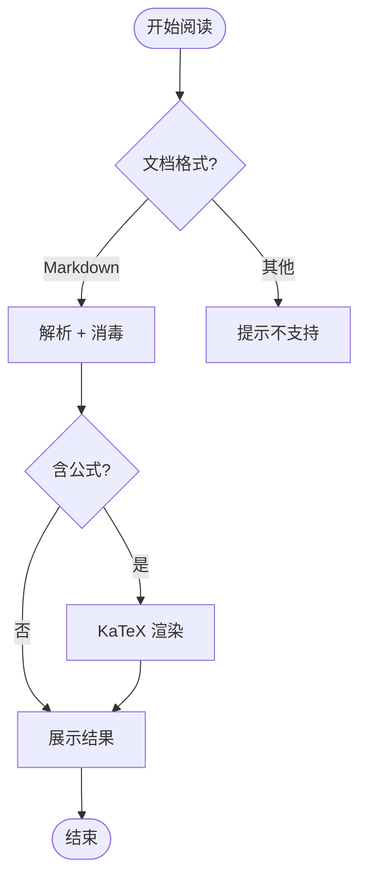

### 2.2 Mermaid：时序图（sequenceDiagram）

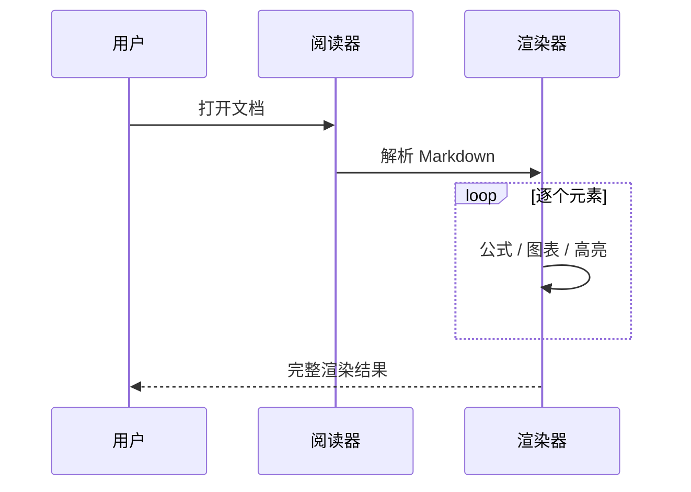

### 2.3 Mermaid：类图（classDiagram）

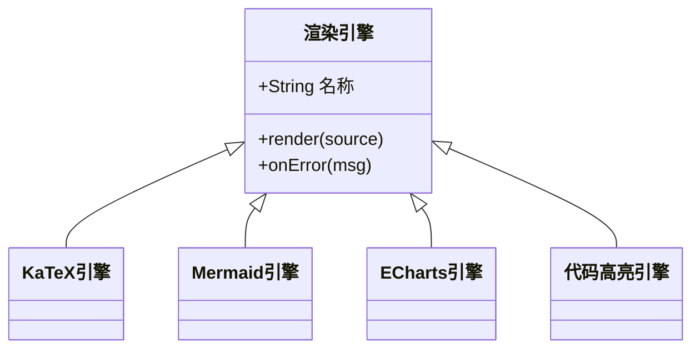

### 2.4 Mermaid：状态图（stateDiagram-v2）

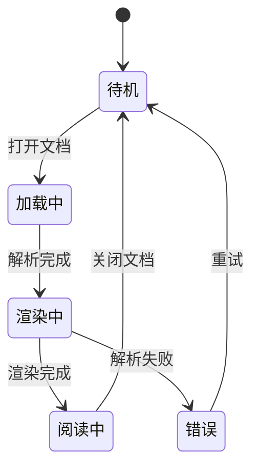

### 2.5 Mermaid：ER 图（erDiagram）

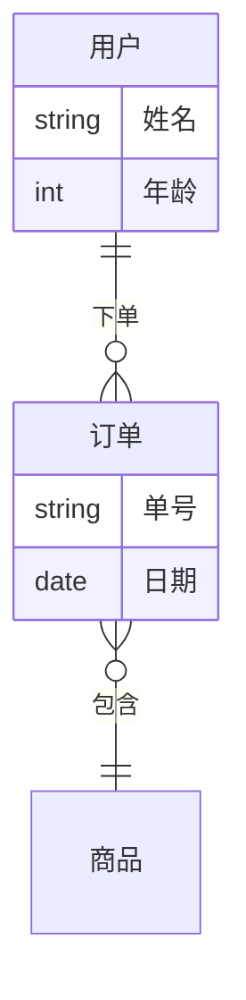

### 2.6 Mermaid：饼图（pie）

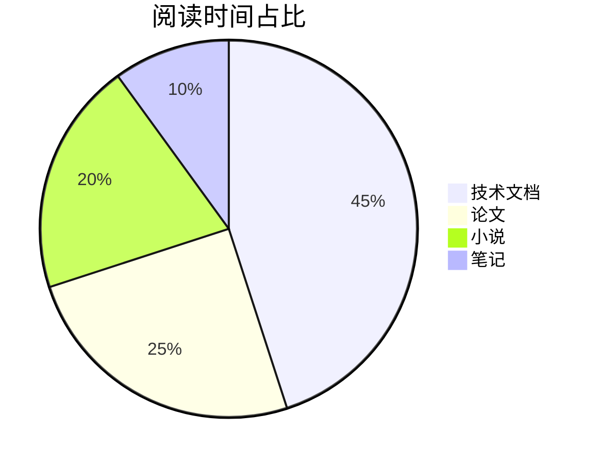

### 2.7 Mermaid：甘特图（gantt）

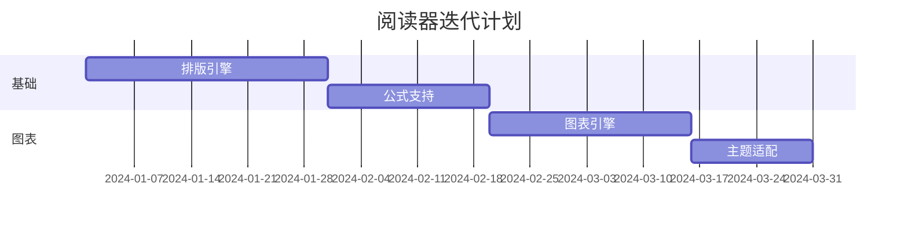

### 2.8 Mermaid：思维导图（mindmap）

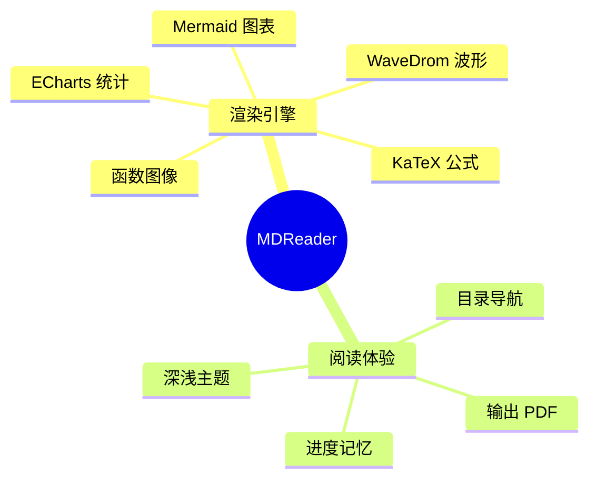

### 2.9 Mermaid：时间线（timeline）

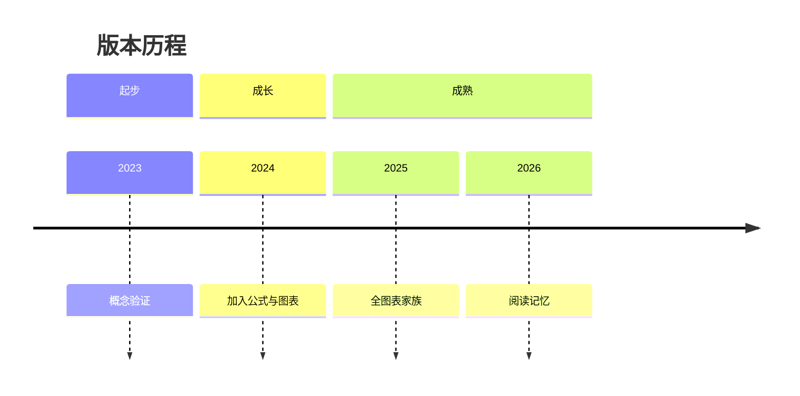

### 2.10 Mermaid：XY 柱线混合图（xychart-beta）

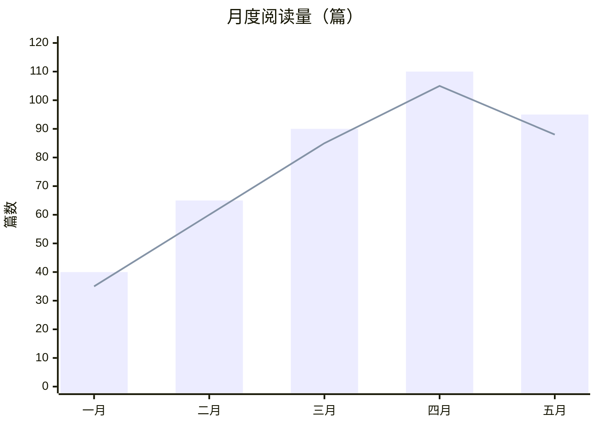

### 2.11 Mermaid：四象限图（quadrantChart）

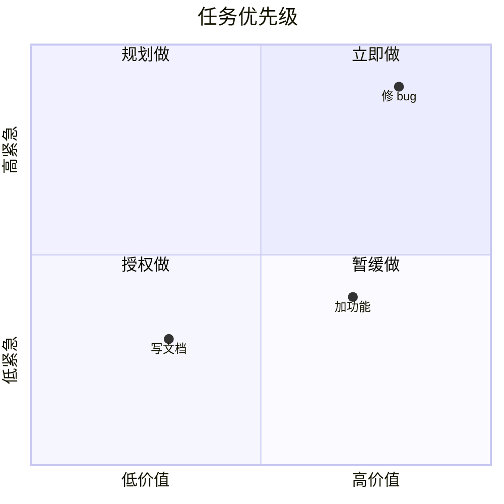

### 2.12 Mermaid：需求图（requirementDiagram）

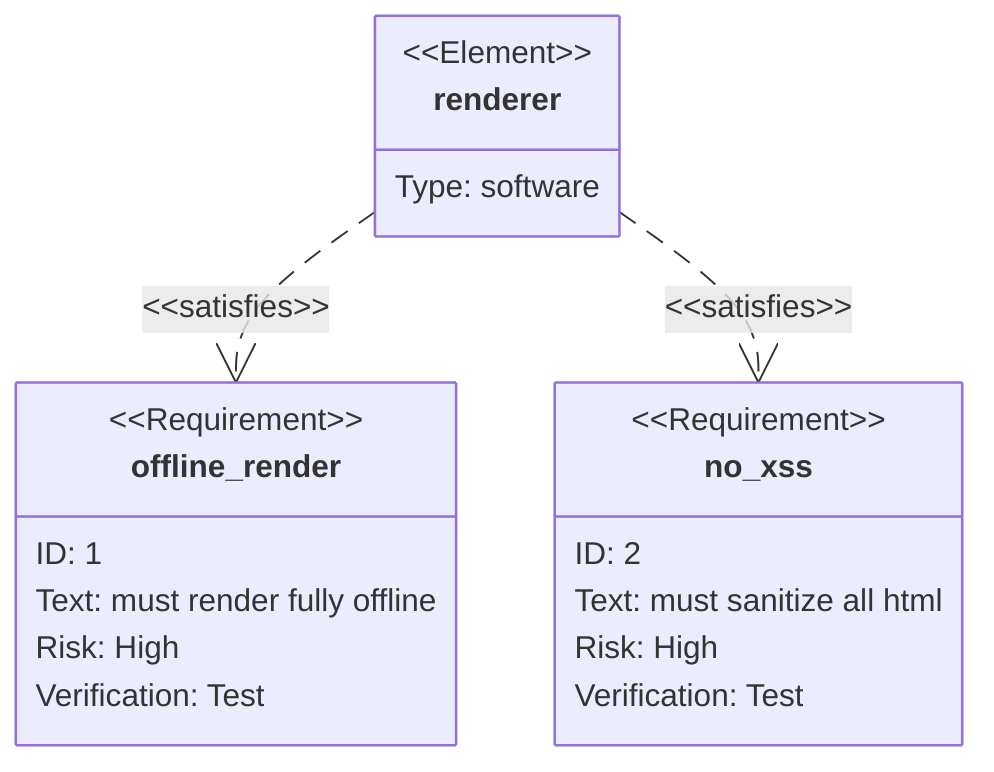

### 2.13 Mermaid：Git 图（gitGraph）

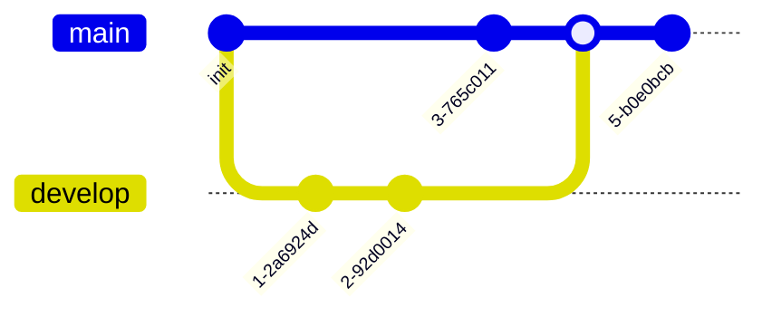

### 2.14 Mermaid：C4 架构图（C4Context）

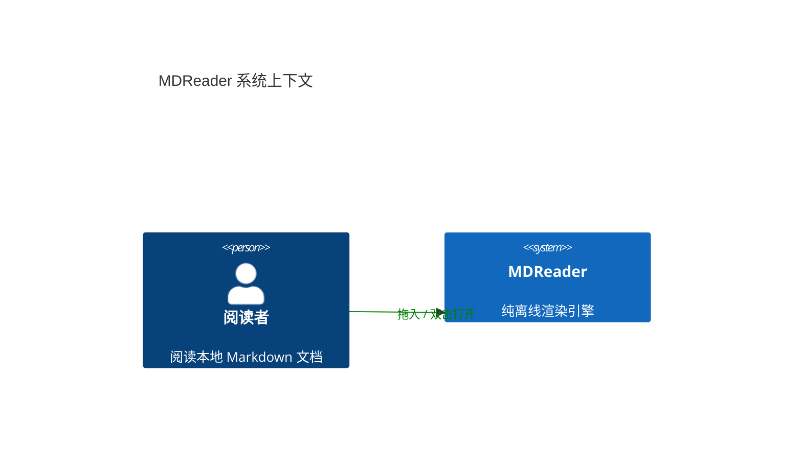

### 2.15 Mermaid：桑基图（sankey-beta）

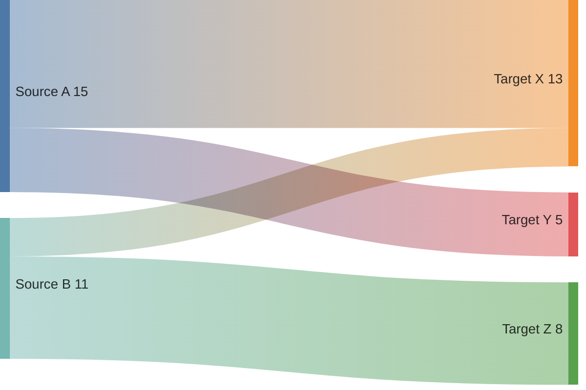

### 2.16 Mermaid：看板（kanban）


### 2.17 Mermaid：块图（block-beta）


### 2.18 Mermaid：报文结构图（packet-beta）

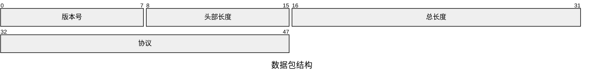

### 2.19 Mermaid：架构图（architecture-beta）


### 2.20 Mermaid：雷达图（radar-beta）

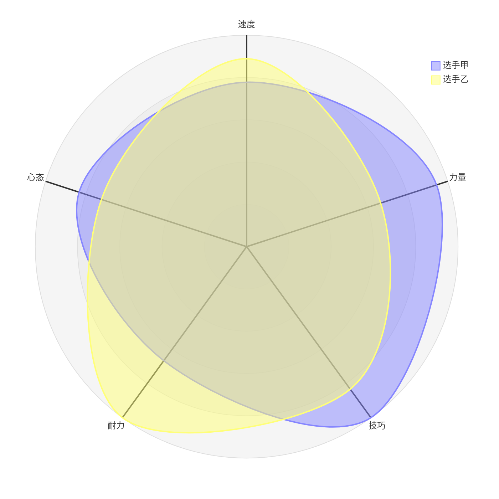

### 2.21 Mermaid：矩形树图（treemap-beta）

```mermaid
treemap-beta
    "存储占用"
        "文档": 60
        "图表缓存": 25
        "主题数据": 10
        "其他": 5
```

### 2.22 Mermaid：旅程图（journey）

```mermaid
journey
    title 用户的一天
    section 早晨
        起床: 5: 我
        通勤: 3: 我
    section 工作
        阅读文档: 4: 我
        编写代码: 5: 我
    section 晚上
        复盘: 3: 我
```

### 2.23 Mermaid：info 图（info）

```mermaid
info
```

### 2.24 ECharts：双轴柱线组合图（可交互）

```echarts 380
{
  "tooltip": { "trigger": "axis" },
  "legend": { "data": ["营收", "增长率"] },
  "grid": { "left": 60, "right": 60, "top": 56, "bottom": 44, "containLabel": true },
  "xAxis": { "type": "category", "data": ["一月", "二月", "三月", "四月", "五月"] },
  "yAxis": [
    { "type": "value", "name": "万元" },
    { "type": "value", "name": "增长率", "axisLabel": { "formatter": "{value}%" } }
  ],
  "series": [
    { "name": "营收", "type": "bar", "data": [120, 180, 150, 220, 260] },
    { "name": "增长率", "type": "line", "yAxisIndex": 1, "smooth": true, "data": [12, 50, -17, 47, 18] }
  ]
}
```

### 2.25 ECharts：散点气泡图（可交互）

```echarts 360
{
  "tooltip": { "trigger": "item" },
  "legend": { "data": ["A 组", "B 组"] },
  "grid": { "left": 60, "right": 40, "top": 40, "bottom": 44, "containLabel": true },
  "xAxis": { "type": "value", "name": "X" },
  "yAxis": { "type": "value", "name": "Y" },
  "series": [
    { "name": "A 组", "type": "scatter", "data": [[10, 30], [20, 45], [30, 25], [40, 70], [50, 60], [60, 40]] },
    { "name": "B 组", "type": "scatter", "data": [[15, 50], [25, 35], [35, 80], [45, 55], [55, 20]] }
  ]
}
```

### 2.26 ECharts：环形饼图（可交互）

```echarts 340
{
  "tooltip": { "trigger": "item", "formatter": "{b}: {c} ({d}%)" },
  "legend": { "bottom": 0 },
  "series": [
    {
      "name": "占比",
      "type": "pie",
      "radius": ["40%", "65%"],
      "data": [
        { "value": 45, "name": "技术文档" },
        { "value": 25, "name": "论文" },
        { "value": 20, "name": "小说" },
        { "value": 10, "name": "笔记" }
      ]
    }
  ]
}
```

### 2.27 ECharts：面积折线图（可交互）

```chart 360
{
  "tooltip": { "trigger": "axis" },
  "legend": { "data": ["CPU", "内存"] },
  "grid": { "left": 60, "right": 40, "top": 40, "bottom": 44, "containLabel": true },
  "xAxis": { "type": "category", "boundaryGap": false, "data": ["00:00", "06:00", "12:00", "18:00", "24:00"] },
  "yAxis": { "type": "value", "name": "%" },
  "series": [
    { "name": "CPU", "type": "line", "smooth": true, "areaStyle": { "opacity": 0.25 }, "data": [30, 52, 88, 64, 40] },
    { "name": "内存", "type": "line", "smooth": true, "areaStyle": { "opacity": 0.25 }, "data": [55, 58, 62, 60, 57] }
  ]
}
```

### 2.28 WaveDrom：数字时序波形

```wavedrom
{
  signal: [
    { name: '时钟', wave: 'p....' },
    { name: '地址', wave: 'x3.x5', data: ['读', '写'] },
    { name: '数据', wave: 'x3.x5', data: ['D1', 'D2'] },
    { name: '使能', wave: '0.1.0' },
    { name: '完成', wave: '0..1.' }
  ],
  head: { text: '总线读写时序' }
}
```

### 2.29 function-plot：函数图像（多曲线）

```function 380
{
  data: [
    { fn: 'sin(x)', color: '#ff7a45' },
    { fn: 'cos(x)', color: '#58c48a' },
    { fn: 'x^2/6 - 1.2', color: '#4aa8ff' }
  ],
  xAxis: { domain: [-6, 6] },
  yAxis: { domain: [-3, 4] }
}
```

### 2.30 function-plot：函数图像（带区间与自定义域）

```fn-plot 340
{
  data: [
    { fn: 'sqrt(x)', color: '#ff7a45', range: [0, 9] },
    { fn: 'x/3', color: '#58c48a' },
    { fn: '-sqrt(x)', color: '#c084fc', range: [0, 9] }
  ],
  xAxis: { domain: [-2, 10] },
  yAxis: { domain: [-4, 6] }
}
```

---

## 三、代码高亮

### 3.1 JavaScript

```javascript
function fib(n) {
  return n <= 1 ? n : fib(n - 1) + fib(n - 2);
}
const seq = Array.from({ length: 10 }, (_, i) => fib(i));
console.log(seq.join(", "));
```

### 3.2 Python

```python
def quicksort(xs):
    if len(xs) <= 1:
        return xs
    pivot, *rest = xs
    left = quicksort([x for x in rest if x < pivot])
    right = quicksort([x for x in rest if x >= pivot])
    return left + [pivot] + right
```

### 3.3 Bash

```bash
#!/usr/bin/env bash
for f in *.md; do
  echo "渲染 $f ..."
done
```

### 3.4 JSON

```json
{
  "name": "MDReader",
  "offline": true,
  "engines": ["KaTeX", "Mermaid", "ECharts", "WaveDrom"],
  "features": ["双主题", "目录导航", "进度记忆", "输出 PDF"]
}
```

---

## 四、排版能力

### 4.1 表格

| 引擎 | 类型 | 离线 | 交互 |
| --- | --- | --- | --- |
| KaTeX | 数学公式 | ✅ | — |
| Mermaid | 23 类图表 | ✅ | 主题联动 |
| ECharts | 统计图表 | ✅ | 悬浮 / 缩放 |
| WaveDrom | 时序波形 | ✅ | — |
| function-plot | 函数图像 | ✅ | — |

### 4.2 任务列表

- [x] 深色 / 浅色双主题
- [x] 智能大纲导航
- [x] 阅读进度记忆
- [x] 输出为 PDF
- [x] 全图表家族
- [ ] 打印分页优化（规划中）

### 4.3 引用块

> 「读书忌太少，读义须反复。」阅读器的意义，是让内容本身被尊重——公式精确、图表清晰、排版克制，一切为阅读让路。

### 4.4 图片


点击图片可放大查看。

---

> **小结**：本文件一次覆盖了 5 个渲染引擎（KaTeX / Mermaid / ECharts / WaveDrom / function-plot）、23 种 Mermaid 图表类型、多种数学结构、多语言代码高亮，以及表格、任务列表、引用、图片等全部排版能力。祝阅读愉快。
